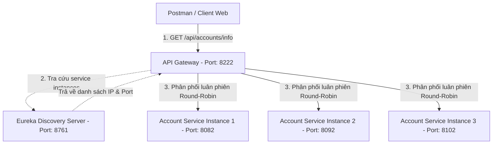

# Cấu hình Load Balancing FinBank với nhiều instance Microservice

Tài liệu này hướng dẫn cách chạy nhiều instance của `Account Service` trên các port khác nhau và cấu hình Load Balancing thông qua API Gateway sử dụng Spring Cloud LoadBalancer.

## 1. Sơ đồ kiến trúc Load Balancing



## 2. Hướng dẫn khởi chạy nhiều instance

### Bước 1: Khởi động Eureka Server và API Gateway
1. Khởi động Eureka Server (Port 8761).
2. Khởi động API Gateway (Port 8222).

### Bước 2: Khởi động 3 instances của Account Service
Mở 3 terminal độc lập để chạy các instance bằng Gradle/Maven hoặc cấu hình trực tiếp trong IntelliJ IDEA:

* **Terminal 1 (Instance 1 - Port mặc định 8082):**
  ```bash
  cd account-service
  ./gradlew bootRun
  ```
* **Terminal 2 (Instance 2 - Port 8092):**
  ```bash
  cd account-service
  ./gradlew bootRun --args='--server.port=8092'
  ```
* **Terminal 3 (Instance 3 - Port 8102):**
  ```bash
  cd account-service
  ./gradlew bootRun --args='--server.port=8102'
  ```

## 3. Xác nhận trên Eureka Dashboard
Truy cập vào URL: [http://localhost:8761](http://localhost:8761).  
Tại mục **Instances currently registered with Eureka**, bạn sẽ thấy dòng trạng thái:
* **ACCOUNT-SERVICE**: `account-service:8082`, `account-service:8092`, `account-service:8102`

---

## 4. Kết quả kiểm thử Load Balancing qua Gateway (Postman)

Khi thực hiện gọi liên tục **9 lần** tới endpoint qua Gateway: `GET http://localhost:8222/api/accounts/info`

| Lần gọi | Response Port | Instance xử lý | Thuật toán nhận diện |
| :---: | :---: | :---: | :---: |
| 1 | 8082 | Instance 1 | Round Robin |
| 2 | 8092 | Instance 2 | Round Robin |
| 3 | 8102 | Instance 3 | Round Robin |
| 4 | 8082 | Instance 1 | Round Robin |
| 5 | 8092 | Instance 2 | Round Robin |
| 6 | 8102 | Instance 3 | Round Robin |
| 7 | 8082 | Instance 1 | Round Robin |
| 8 | 8092 | Instance 2 | Round Robin |
| 9 | 8102 | Instance 3 | Round Robin |

**Nhận xét:** Thuật toán Round Robin đã tự động phân phối các request đều đặn tuần tự qua các instance đang hoạt động.

---

## 5. Kết quả khi tắt 1 Instance (Port 8102)

Khi thực hiện tắt Instance 3 (Port 8102) và tiếp tục gửi request lên Gateway:
* Gateway tự động cập nhật danh sách instance còn hoạt động (sau khi nhận tín hiệu từ Eureka Server).
* Kết quả phân phối tải xoay vòng cho 2 instance còn lại như sau:

| Lần gọi | Response Port | Instance xử lý |
| :---: | :---: | :---: |
| 1 | 8082 | Instance 1 |
| 2 | 8092 | Instance 2 |
| 3 | 8082 | Instance 1 |
| 4 | 8092 | Instance 2 |

**Kết luận:** Hệ thống đã chứng minh tính sẵn sàng cao (High Availability), tự động loại trừ các service instance bị tắt/lỗi mà không gây gián đoạn trải nghiệm người dùng.